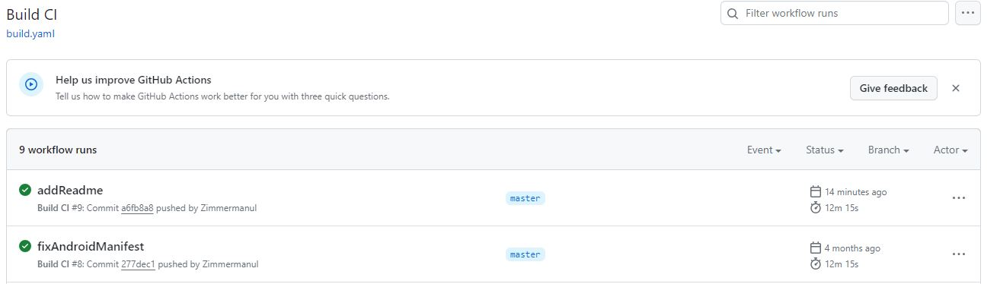
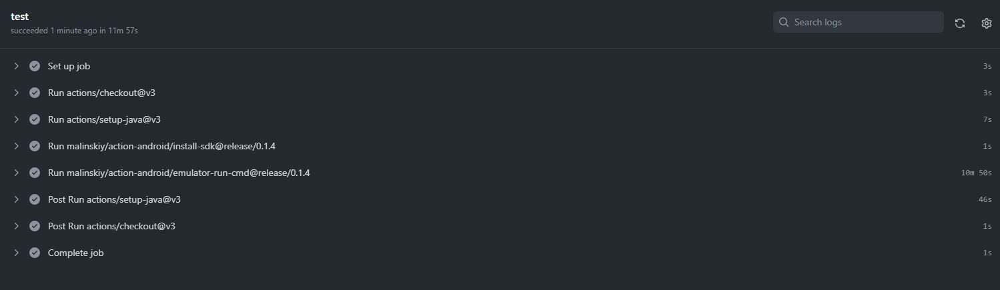

#  Android app with native mobile Ui tests on Kaspresso with emulators, remote execution on Github
This project is example of Android application with simple native UI tests on Kaspresso with emulators and remote launch on Github.

It was made as an example of my working with setting up CI for running mobile tests with emulators.

